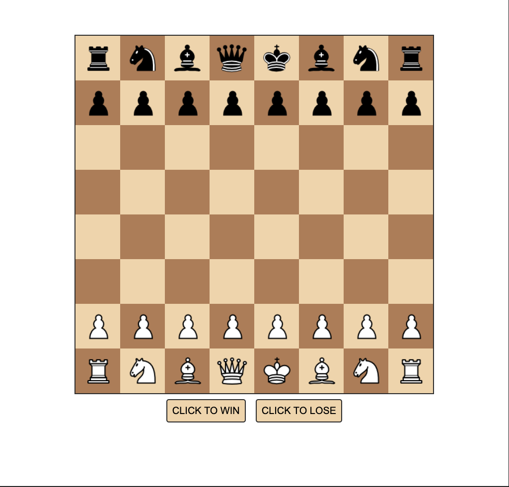
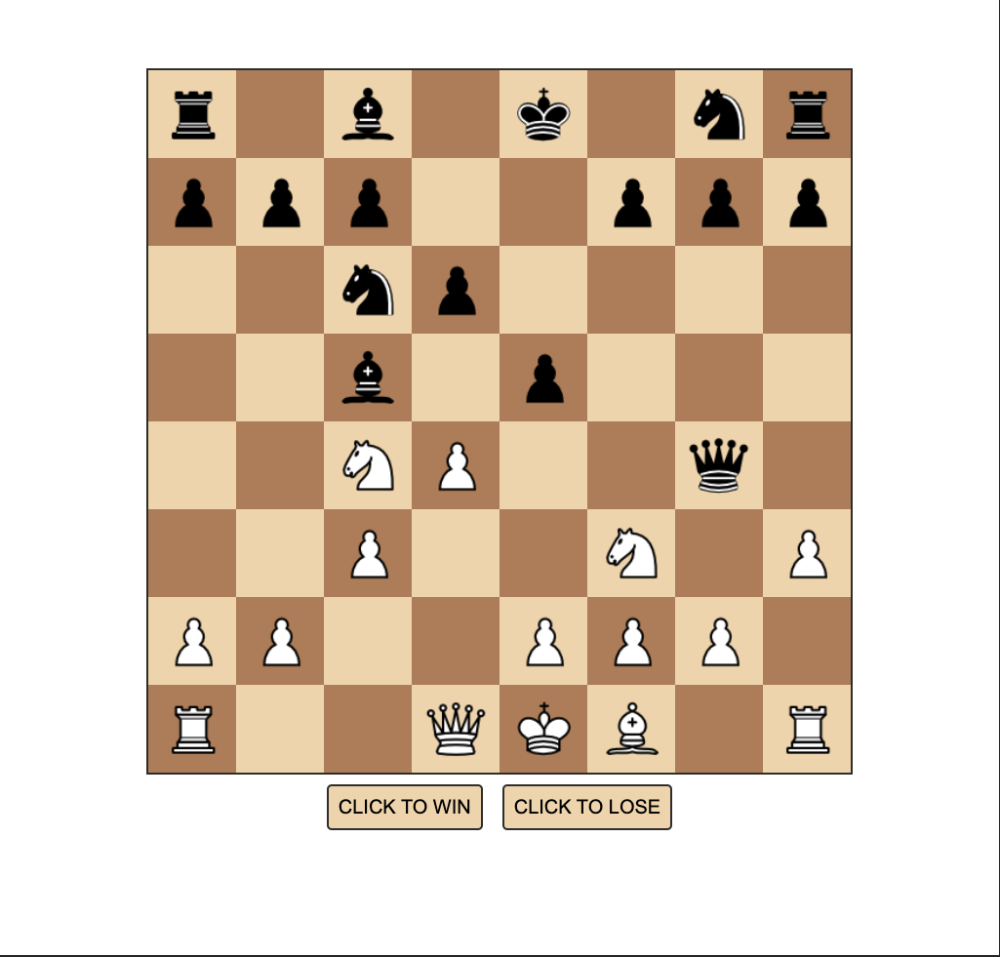

# Simple Chess Game

This project is a simple implementation of a chess game using JavaScript.

Play it here https://hemyulin.github.io/js-chess/

# Screenshot #1

# Screenshot #2

## Features

- A welcome screen with a start button to begin the game.
- A chess board with all the pieces placed at their initial positions.
- The ability to move pieces by clicking on a piece and then clicking on the square to move it to.
- Win and lose buttons to end the game.

## How to Run

Open the `index.html` file in your web browser to start the game.

## How to Play

1. Click the "START NOW" button on the welcome screen to start the game.
2. Click on a piece to select it. The selected piece will be highlighted.
3. Click on a square to move the selected piece to that square. If there is a piece of the opposite color on the square, it will be captured.
4. Click the "CLICK TO WIN" or "CLICK TO LOSE" button to end the game.

## Future Improvements

- Add rules for each type of piece to only allow legal moves.
- Add the ability to play against a computer opponent and/or online.
- Add a timer to limit the amount of time each player has to make a move.
